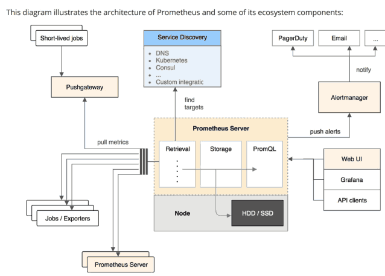

 序章

序章：做本专题讲座的内容简介

- 第一讲：企业级运维监控理理论基础
- 第二讲：企业监控通用技术
- 第三讲：Prometheus 监控入⻔门简介
- 第四讲：Prometheus 运行行框架介绍
- 第五讲：Prometheus 数据格式介绍
- 第六讲：Prometheus 初探和配置（安装测试）
- 第七讲：Prometheus 数学理理论基础学习 （prometheus 数学consule使用）
- 第八讲：Prometheus 命令行行使用扩展
- 第九讲：企业级监控数据采集方法
- 第十讲：企业级监控数据采集脚本开发实践
- 第十一讲：Prometheus 之 exporter模块采集深入学习
- 第十二讲：Prometheus 之 Pushgateway模块深入学习
- 第十三讲：Grafana 超实用企业级监控绘图工具的结合
- 第十四讲：Prometheus 企业级实际使用（一）
- 第十五讲：Prometheus 企业级实际使用（二）
- 第十五讲：Prometheus 企业级实际使用（三）
- 第十六讲：Alertmanager连用（可选）
- 第十七讲：Pagerduty连用（重要

##  先简单看一眼 Prometheus的整体框架图 

## 我们来谈谈监控对运维的重要性和地位

运维是什么？

说白了就是管理服务器，保证服务器给线上产品提供稳定运的的服务环境

监控是什么？

说白了 就是一种形式 去盯着 观察服务器
把服务器的各种⾏为表现都显⽰出来 以发现 问题 和 不⾜

报警是什么？ 

监控和报警这两个词定要分开说 分开理解！

 监控是监控
报警是报警。 

监控是把⾏为表现展⽰出来，来观察的

报警则是 当监控获取的数据
发⽣异常并且到达了某个临界点的时候，采各种途径来通知户 通知管理 员
通知运维⼈员 甚⾄通知⽼板

很多时候 总是把监控和报警混在起说 这是不正确的 需要纠正 如下图所⽰

##  我们先来谈谈监控都有哪些组成部分 和流程

监控本看的是数据，数据从哪来？
数据不是凭空从天上掉下来的，也不是研发⼈员主动给你的，只能是从运维数据采集来.

数据采集本就是门学问，不仅仅是为监控提供服务/ 分析户⾏为 /
安全策略 数据采集是什么？ 数据采集的⽅式

##  我们来看个Prometheus + Grafana 的个数据监控采集成图

prometheus 数据采集后的成图

集联Grafana这个强的绘图具后，更加美观和直观

---Prometheus + Grafana成图

其实 上下两个图 都来⾃于同份采集数据，既不冲突 又提供利率

##  我们来谈谈报警

报警跟监控 严格来说 是需要分开对待的 因为报警 也有专门的报警系统

报警系统 包括⼏种主要的展现形式 ：
短信报警，邮件报警，电话报警（语⾳播报）, 通讯软件 不像监控系统
⽐较成型的报警系统 ⽬前多数都是收费的 商业化

报警系统中 最重要的个概念之 就是对报警阈值的理解 阈值(Trigger
Value) ，是监控系统中 对数据到达某个临界值的定义

例如： 通过监控发现，当前某台机器的CPU突然升⾼，到达了
## 9%的使率，99 就是作为次报警的 触发阈值

##  我们来看眼 本章节给家即将讲到的款 优秀的美国商业报警系统
