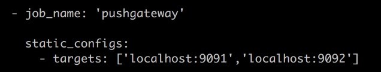
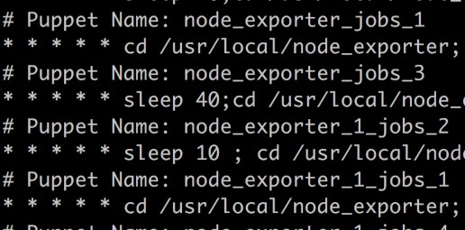
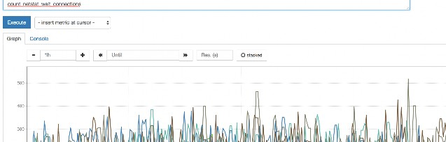

# 第⼗讲：企业级监控数据采集脚本开发实践(pushgateway)

- 第⼗讲内容：
    - pushgateway 的介绍
    - pushgateway 的安装和运⾏和配置
    - ⾃定义编写脚本的⽅法 发送pushgateway 采集
    - 使⽤pushgateway的优缺点


##  pushgateway 的介绍


pushgateway 是另⼀种采⽤被动推送的⽅式（⽽不是exporter 主动获取）获取监控数据的prometheus 插件


在上篇中 我们对pushgateway已经做过介绍


它是可以单独运⾏在 任何节点上的插件（并不⼀定要在被监 控客户端）


然后 通过⽤户⾃定义开发脚本 把需要监控的数据 发送给

pushgateway

然后pushgateway 再把数据 推送给prometheus server


接下来咱们来实践


## pushgatway 的安装和运⾏和配置


pushgateway 跟 prometheus和 exporter ⼀样


- 下载地址
    - https://prometheus.io/download/#pushgateway

- 运⾏
    ```
    解压后 直接运⾏
    github的官⽅地址
    https://github.com/prometheus/pushgateway 
    又是以go语⾔开发的， ⽤go开发的程序 在安装运⾏时 就是这 么得天独厚的 简单任性

    同样 我们使⽤ daemonize ⽅式 讲pushgateway 放⼊后台运⾏

    root 13980 13976 16 1⽉19 ? 4-19:53:51 /data/
    pushgateway/pushgateway
    root 13981 13978 0 1⽉19 ? 04:15:08 /data/pushgateway/
    pushgateway1 -web.listen-address 0.0.0.0:9092
    
    ```
- 在prometheus sever端的配置
    - 关于pushgateway的配置 主要指的是 在prometheus sever端的配 置我们来看下
    - 
    - 在prometheus.yml 配置⽂件中， 单独定义⼀个job 然后 target 指向到 pushgateway运⾏所在的 机器名和 pushgateway运⾏的端⼜ 即可
        - 这⾥我们发现了没有， localhost:9091/9092 ⼤⽶⽼师企业中 使⽤的 pushgateway开启了两个在prometheus_server 本机上
        - 为什么开启两个 我最后⼀个段落给⼤家解释


## ⾃定义编写脚本的⽅法 发送pushgateway 采集 接下来 进⼊重头戏了

pushgateway 本⾝是没有任何抓取监控数据的功能的 它只是被 动的等待推送过来

所以 让我们来学习 pushgateway 编程脚本的写法 如下是⼀段 ⽣产环境中 使⽤shell 编写的 pushgateway脚本

⽤于抓取 TCP waiting_connection 瞬时数量


cat /usr/local/node_exporter/node_exporter_shell.sh

```shell
#!/bin/bash


instance_name=`hostname -f | cut -d'.' -f1` #本机机器名 变量

⽤于之后的 标签


if [ $instance_name == "localhost" ];then # 要求机器名 不能是

localhost 不然标签就没有区分了

echo "Must FQDN hostname" exit 1

fi


# For waitting connections

label="count_netstat_wait_connections" # 定⼀个新的 key

count_netstat_wait_connections=`netstat -an | grep -i wait | wc -l`

#定义⼀个新的数值 netstat中 wait 的数量


echo "$label : $count_netstat_wait_connections"


echo "$label $count_netstat_wait_connections" | curl --data- binary @- http://prometheus.server.com:9091/metrics/job/ pushgateway1/instance/$instance_name

```

#最后 把 key & value 推送给 pushgatway


curl —data-binary

将HTTP POST请求中的数据发送给`HTTP服务器器(pushgateway)`， 与⽤用户提交HTML表单时浏览器器的⾏行行为完全⼀一样。

HTTP POST请求中的数据为纯⼆二进制数据

从上⾯的 短短的⼗⼏⾏的脚本来看 其实最重要的 是`两个标红的地⽅`

count_netstat_wait_connections=`netstat -an | grep -i wait | wc -l`


后⾯红⾊部分 是我们通过Linux命令⾏ 就简单的获取到了 我 们需要监控的数据 TCP_WAIT数

http://prometheus.server.com:9091/metrics/job/pushgateway1/ instance/$instance_name


最后这⾥ ⽤POST ⽅式 把 key & value 推送给 pushgatway的URL地址 这个URL地址中 分成如下三个部分

http://prometheus.server.com:9091/metrics/job/pushgateway1

这⾥是 URL的主location


job/pushgateway1

这⾥是 第⼆部分 第⼀个标签： 推送到 哪⼀个prometheus.yml 定义的 job⾥


{instance=“server01"} instance/$instance_name

这⾥是 第⼆个标签 推送后 显⽰的 机器名是什么


其实 pushgateway的脚本 并不是很难写 但是通过这样的脚本编程⽅式

我们可以很快速的 ⾃定义 我们需要的任何 监控数据(Linux 命 令⽅式)


最后 这个我们编写的监控bash脚本 是⼀次性执⾏的 bash script.sh

我们需要按时间段 反复执⾏


所以呢？⾃然就得结合 contab了

这⾥顺带提⼀句


crontab 默认 只能最短⼀分钟的间隔 如果希望 ⼩于⼀分钟的间隔 15s


我们使⽤如下的⽅法


sleep 10

sleep 20




之后 我们回到prometheus主界⾯ 尝试输⼊ 由我们⾃⼰定义的

new_key

看看结果


key的名字 就是这个 label="count_netstat_wait_connections"

# 定⼀个新的 key





嘿嘿 很愉快 对不？


其他种类的监控数据 我们都可以通过类似的形式 直接写脚本 发送

使⽤python 也是很好的⽅式

不过我个⼈还是推荐 bash shell 因为速度超级的快～ （⽤

image

python的话 还得include 很多库 ⼤⽶⽼师有点懒 哈哈😄 ）


##  使⽤pushgateway的优缺点


⼤⽶之前就跟⼤家说过 pushgateway这种⾃定义的 采集⽅式

⾮常的快速 ⽽且极其灵活 ⼏乎不收到任何约束


其实我个⼈ 还是⾮常希望 使⽤pushgateway来获取监控数据的


各类的exporters虽然玲琅满⽬ ⽽且默认提供的数据很多了已 经


⼀般情况下 我在企业中 只安装 node_exporter 和 DB_exporter

两个


其他种类的 监控数据 我倾向于 全部使⽤pushgateway的⽅式 采集 （要的就是快速～ 灵活~）

不过⾔归正传 习惯并不代表正确性


pushgateway虽然灵活 但是 也是存在⼀些 短板的 接下来 我们来看看 prometheus官⽹是怎么说的


WHEN TO USE THE PUSHGATEWAY


• Should I be using the Pushgateway?

 
• Alternative strategies

  

The Pushgateway is an intermediary service which allows you to push metrics from jobs which cannot be scraped. For details, see Pushing metrics.

Should I be using the Pushgateway?

We only recommend using the Pushgateway in certain limited cases. There are several pitfalls when blindly using the Pushgateway instead of Prometheus's usual pull model for general metrics collection:
• When monitoring multiple instances through a single Pushgateway, the Pushgateway becomes both a single point of failure and a potential bottleneck.

• You lose Prometheus's automatic instance health monitoring via the up metric (generated on every scrape).

• The Pushgateway never forgets series pushed to it and will expose them to Prometheus forever unless those series are manually deleted via the Pushgateway's API.


The latter point is especially relevant when multiple instances of a job differentiate their metrics in the Pushgateway via

an instance label or similar. Metrics for an instance will then

remain in the Pushgateway even if the originating instance is

renamed or removed. This is because the lifecycle of the Pushgateway as a metrics cache is fundamentally separate from the lifecycle of the processes that push metrics to it. Contrast this to Prometheus's usual pull-style monitoring: when an instance disappears (intentional or not), its metrics will automatically disappear along with it. When using the Pushgateway, this is not the case, and you would now have to delete any stale metrics manually or automate this lifecycle synchronization yourself.

Usually, the only valid use case for the Pushgateway is for capturing the outcome of a service-level batch job. A "service- level" batch job is one which is not semantically related to a specific machine or job instance (for example, a batch job that deletes a number of users for an entire service). Such a job's metrics should not include a machine or instance label to decouple the lifecycle of specific machines or instances from the pushed metrics. This decreases the burden for managing stale metrics in the Pushgateway. See also the best practices for monitoring batch jobs.

Alternative strategies

If an inbound firewall or NAT is preventing you from pulling metrics from targets, consider moving the Prometheus server behind the network barrier as well. We generally recommend running Prometheus servers on the same network as the monitored instances.

For batch jobs that are related to a machine (such as automatic security update cronjobs or configuration management client runs), expose the resulting metrics using the Node Exporter's textfile module instead of the Pushgateway.

⼀⼤堆的英⽂ 其实总结起来 基本上两点


1. pushgateway 会形成⼀个单点瓶颈，假如好多个 脚本同时 发送给 ⼀个pushgateway的进程 如果这个进程没了，那么监控数据也就没了


2. pushgateway 并不能对发送过来的 脚本采集数据 进⾏更智 能的判断 假如脚本中间采集出问题了

那么有问题的数据 pushgateway⼀样照单全收 发送给 prometheus

虽然有这么两个所谓的缺点 但是实际上通过我 2年多的使⽤

对于第⼀条缺点 其实只要服务器不当机 那么基本上

pushgateway运⾏还是很稳定的

就算有太多的脚本 同时都发送给⼀个pushgateway 其实也只是 接收的速度会变慢 丢数据没有遇到过 （有的时候 我甚⾄觉得

⽐exporters还稳定 exporters倒是 有时候会真的就当机 或者 丢 失数据 因为exporters开发⽐较复杂 越简单的东西 往往越稳 定）


对于第⼆条缺点

其实只要我们在写脚本的时候 细⼼⼀些 别出错（这也是为什 么 我推荐就⽤ bash 写 因为简单不容易出错 ， python我可不 敢打包票）

那么 监控数据也不会有错误

所以说呢 相信⼤⽶ 我们就放⼼的使⽤pushgateway来尽情采集

我们的数据吧


课堂的结尾 给⼤家留⼀个作业吧（学习需要勤快）


我们⾃⼰搭建pushgateway 并⾃⾏编写⼀个 采集脚本 （bash shell即可）

采集⼀个 ping 延迟和丢包率吧 ^_^


image


image


image

