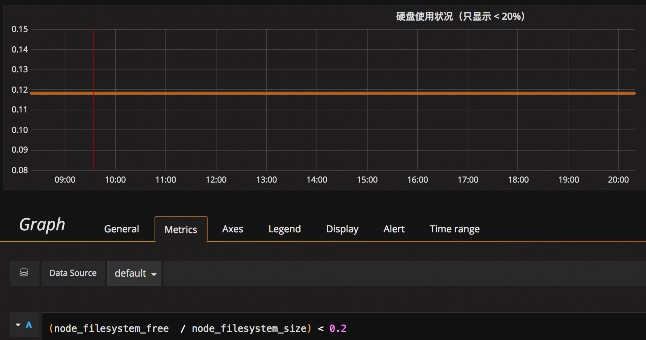

第⼗三讲：Prometheus 企业级实际使⽤用

第十三讲内容：
- prometheus+grafana 企业CPU监控 真实案例
- prometheus+grafana 企业内存监控 真实案例
- prometheus+grafana 企业硬盘/IO监控 真实案例
- prometheus+grafana 企业⽹络传输 真实案例

##  prometheus+grafana 企业CPU监控 真实案例 我们在企业中 基础监控的第⼀项 ⼀般就是 针对服务器集群的

CPU 进⾏监控 为什么呢？

1. CPU是处理所有任务的核⼼（这是废话）
2. 另外 Linux 由于CPU存在各种 状态类型CPU时间 所以 很多情况下 ⼤部分的出现问题的情况都可以 反应在CPU的表现上

下⾯举⼀个 

在企业中对CPU使⽤率监控的实例 数据采集： Node_exporter

使⽤prometheus公式

> (1-((sum(increase(node_cpu{mode="idle"}[1m])) by (instance)) / (sum(increase(node_cpu[1m])) by (instance)))) * 100

第⼀幅图 就是咱们之前 讲过的，计算CPU综合使⽤率 这⾥就

不再重复它的计算⽅法了 （可以回顾 下篇的 6 7讲） 在⽣产环境中 ⼀般70-80%以上的CPU⾼ 是因为 ⽤户态user CPU⾼所导致

我们使⽤Top命令随便查看⼀台服务器的时候 ⼀般也会看到

user%会最⾼

⽤户态的CPU使⽤率 是跟应⽤程序（或者说软件）的运⾏密 切相关的

当软件启动⼤量进程 并⾏处理任务时， 当进程之间频繁上下 业切换时 对⽤户态的CPU 消耗最⼤

不过我们 在做监控的时候 ⼀般倒是不⽤ 单独列出⼀个 user% 态的CPU使⽤率图 因为 除去IO等待造成的CPU⾼之外，⼤部 分情况 就是 user%造成

另外， system% 内核态的CPU 使⽤率 偶尔也会出现⾼的情 况，我们这个课程中 就不再讲解了

使⽤prometheus公式

> (sum(increase(node_cpu{mode="iowait"}[1m])) by (instance) / sum(increase(node_cpu[1m])) by (instance) ) * 100

第⼆个图 是针对 IOWAIT类型的 CPU等待时间 user%

其中不同的地⽅ 是mode=iowait

很多情况下 ， 当服务器 硬盘IO占⽤过⼤时，CPU会等待IO 的返回 进⼊ interuptable 类型的CPU等待时间

所以 对于 IOWAIT CPU的监控 是很有必要的

grafana

另外 对于CPU⾼的报警阈值 是这样的设置的

设置成 99 或者 100 都可以

如果设置成 80 90 就报警，根据实际测试 并不合适，因为

80% 90%状态下的服务器 还是可以处理请求的 只不过速度会慢了

但是 ⼀旦综合CPU上了 98 99 100 那么整个服务器 就⼏乎失 去可⽤性了 连SSH登录 有时候都很困难

所以 针对Linux系统的优化 ⾮常重要 要通过各种内核参数 软 件参数 来控制服务器 尽量不让CPU堆到 99 100 （更多Linux 内核优化知识 请关注⼤⽶运维 第三 四 阶段）

## prometheus+grafana 企业内存监控 真实案例

接下来 就到了 内存监控了

⾸先 ⼤⽶需要给⼤家 说⼀下 内存的计算⽅式 我们先从Linux命令来看起

free -m

Centos 6.x 5.x

Centos 5/6 的版本中 如上图显⽰内存（4.x就不说了 基本绝迹 了）

内存管理 是Linux内核的 ⾮常重要的⼀个强势功能

可以说 Linux对于内存的使⽤率 ⾮常的⾼校 ⽐起windows来说 真的智能了很多

主要依赖于 Linux内存管理的 缓存功能 （简单来说就是 刚⽤ 过的内存中的内容 会被暂时缓存⼀段时间 以备下次再使⽤ 快 速调⽤）

然⽽ 5.x 6.x 的 内存命令 却有⼀点 不太善解⼈意

对于 ⼤多数的零基础和初级学员来说, 命令⾏显⽰的这个

很容易让⼈误解（甚⾄我遇到 很多⼯ 作5年以上的⼈ 居然还有搞不清这⾥的）

关于Linux的内存种类 和内存管理细节 我们这⾥就不过多阐

述了

直接给出⼤家 5.x 6.x 的真实内存使⽤率公式即可

从应⽤用程序的⻆角度来说，Linux 实际可⽤用内存=系统free memory+buffers+cached。

使⽤率 = 实际可⽤内存 / 总内存 

Centos 7.x

对于 最新的 7.x中

free 命令⾏的输出 解决了这个问题 变得简单易懂

实际可⽤内存 直接放在最后⼀列 直接使⽤

接下来我们来看 企业实际内存监控案例

给出⼤家prometheus 公式

> (1-((node_memory_Buffers + node_memory_Cached + node_memory_MemFree) / node_memory_MemTotal)) * 100 (6.x 7.x free , 监控 6 7 )

这⾥就很清楚了 跟上⾯讲的是对应的算法

从图上 可以看出 ⼤部分机器的内存使⽤率 ⽐较低 基本都在

20%以下

是因为 之前的⽣产环境使⽤中 并不是内存密集型的 （是CPU 密集型）

所以说 我们从内存的计算公式来说， promehtues也让我们很 精细 很放⼼ ， 很多⽼式的监控 直接返回⼀个 内存使⽤率 很 多时候 ⽆法确认准确性

• prometheus+grafana 企业硬盘/IO监控 真实案例 数据来源 : Node_exporter

硬盘剩余容量的监控 相⽐上⾯的2个 就简单很多

> (node_filesystem_free / node_filesystem_size) < 0.2(nagios )

公式上看 也很好理解 当空闲硬盘 ⼩于 0.2的时候 就显⽰在图 上

## predict_linear

另外 提到了 硬盘使⽤率

我在这⾥ 给⼤家推荐另⼀个 难度较⾼的 prometheus 函数

关于这个函数 我们后⾯会讲解

在这⾥ 我们先提出⼀个 对于硬盘监控的⽐较新的理念

对于硬盘使⽤率来说

通常不管使⽤ 什么样⼦的监控⼯具 基本上 都是简单算法 空 闲/总量 或 以使⽤/总量 当⼤于或⼩于 ⼀个阈值时 报警

这么定义的⽅法 ⽐较简单也普遍

那么我给⼤家提⼀个问题 假如有这么⼀种情况

有⼀天晚上8:00的时候 ⼀台很重要的服务器上 硬盘使⽤率超 过了 90%

超过了报警阈值 于是乎 报警电话就响了

结果运维⼈员上线⼀看 哦 还有百分10的空间呢 根据以往的 经验 10%的空间基本上 还能撑个 3,4天呢

况且 我们的服务器 每天24:00还会做 ⽇志压缩呢 会释放很多 空间

image

所以 不着急处理 就回去睡觉了😪

又有⼀天晚上 10:00的时候 还是这台服务器 又报警了 >90% 这次运维⼈员 还是⽼样⼦ 觉得没啥⼤事 就去睡觉了 报警也 给屏蔽了（电话是很吵⼈的）

结果 到了10:10分的时候 整个⽣产线上报警了 ⽼板也给吵起 来了

image

运维慌慌张张打开电脑⼀看…. 我靠！！

硬盘100% 导致nginx服务⽆法响应了….. 怎搞的啊 平时不会这样⼦啊

后来经过分析 是由于 晚上 9:00的时候 服务器系统上的APP软 件 出现了⼀个死循环的错误

超⼤量的 info/warning⽇志 把整个 根⽬录都给盛满了 ⽽且⽤ 的时间 很短

image

运维哭了😢

运维这个时候想，既然会有这种特殊情况 那么⼲脆把 报警阈 值 设置的更⾼⼀些吧

70%就报警好了 … 结果 可想⽽知 往后的⽇⼦⾥ 运维都是⿊ 圆圈了。。。

image

image

给⼤家讲这个真实发⽣过的 运维故事（嘿嘿 😁 其实那个运维 就是5年前的我） 就是想告诉⼤家 prometheus 针对这种特殊的问题 提供了⼀个 ⾮常⽜X的函数

image

这个函数 如果想讲清楚它的底层实现原理 没个 2 3天还真说 不完

我们在这⾥就给⼤家简单介绍⼀下它能做什么吧 对于刚才那种 硬盘百分⽐报警的案例(剩余空间的百分⽐) predict_linear() 函数 可以起到 对曲线变化速率的计算 以及在

⼀段时间 加速度的未来预测

说的更简单⼀些

它可以 实时监测 硬盘使⽤率曲线的 变化情况，假如在⼀个很

⼩的时间段中 发现硬盘使⽤率 急速的下降（跟之前平缓时期 相⽐较）

那么对这种下降的速度 进⾏⼀个未来⼀段时间的预测 ， 如果

发现 未来 ⽐如5分钟内 按照这个速度 硬盘肯定就100%了 那么 在当前硬盘还剩余 20%的时候 就会报警！

说起来都觉得绕⼜ 不过使⽤起来 并不是很难

官⽹有 predict_linear（）的 使⽤⽅法介绍

https://prometheus.io/docs/prometheus/latest/querying/functions/#predict_linear()

另外 也有针对这个 函数的 基础理论 Linear 数学计算模型 的介绍

https://en.wikipedia.org/wiki/Simple_linear_regression

image

image

看这个数学计算公式 …..😳

总之 promehtues就是这样⼀个 有各种⽣活⼤爆炸型的数学家

（也可能是物理学家哦） 通过他们的⾟勤努⼒ 给我们提供了

⾮常繁多的 这种复杂计算的实⽤函数 为的都是 把监控做的越来越好

然后 我们来看下 硬盘IO使⽤的 监控

image

使⽤的公式

((rate(node_disk_bytes_read[1m] )+ rate(node_disk_bytes_written[1m])) / 1024 /1024) > 0

硬盘使⽤率 是 read + written 读和写 都会占⽤IO

/1024 两次后 就由 bytes => Mbs

如果这个指标标⾼了， 那么必然 CPU_IOWAIT 也会飙⾼

（所以说 从这⾥ 我们也可以看得出 报警中 很多项⽬ 虽然重要 但是⽆法避免重复 都有⼀定 的连带关系 这也是⼤⽶为什么在上篇中 给⼤家提出了⼀个 真实链路报警的 未来展望）

• prometheus+grafana 企业⽹络传输 真实案例

image

使⽤公式 rate(node_network_transimit_btyes[1m]) /1024 /1024

image

最后这个 咱们 之前在 7 8讲的时候 ⽤过它举过例⼦ 这⾥就不再重复了 公式⼤家可以直接使⽤ 休息⼀下吧 等待进⼊后⾯的课程

image

image

image
