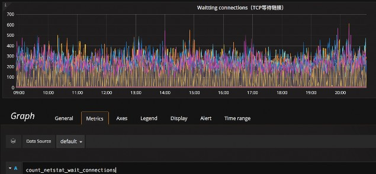
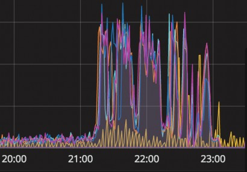
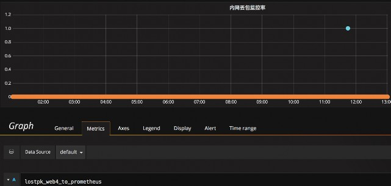
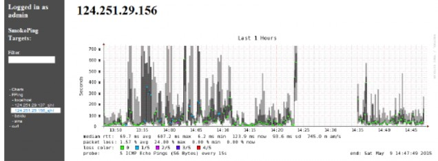

# 第14讲 Prometheus 企业级实际使⽤(TCP等待链接⽂件描述符⽹络丢包率监控)


内容

- Prometheus+grafana TCP等待链接监控 企
- Prometheus+grafana ⽂件描述符监控 企业 实际使⽤
- Prometheus+grafana ⽹络丢包率监控 企业
业实际使⽤


TCP等待链接 其实之前应给⼤家 ⽤这个举例⼦好⼏次了





使⽤公式

count_netstat_wait_connections ⼀个key⾜够了 gauge

数据来源： pushgateway + 脚本


其实 node_exporter 也有对应的 tcp wait

不过 ⾥⾯提供的 各种 tcp 状态的数据种类 实在太多 太细了

（我有点懒得去 ⼀个⼀个TCP状态 加起来出监控 ， 不过感 兴趣的同学 可以⾃⼰尝试）


索性 我这⾥就⽤脚本⾃⼰写⼀个了


处于各种 wait状态的 TCP链接 是作为运维 平⽇排查(⽹络负 载,服务器的负载，DB)的⼀个重要指标

netstat

Close_wait , time_wait 等等。。(TCP链接的⽅向 ) TCP协议


⼀般当 wait类型的TCP 过⼤时

⼀定说明 系统⽹络负载（流量负载） 出现问题了

内核优化

⽐如这种状况



导致这种 状况的原因 很多 并⾮只会因为 ⽹络不给⼒

还跟 访问请求量 攻击流量 数据库 CPU 等等 都有可能引起

## Prometheus+grafana ⽂件描述符监控 企业 实际使⽤

Linux系统 我们之前在 系列课程上篇时 提到过 本⾝就是⼀个

基于⽂件表达的操作系统 任何资源的使⽤ 都可以映射成⼀个⽂件

⽂件 和 ⽂件句柄（Linux中 叫做⽂件描述符更准确 不过习惯

叫句柄 不好改⼜了） 虽然并⽆直接联系 但是 有间接的连带 关系


如下是⼀段 ⽹上对⽂件描述符的解释 我们来看下


⽂文件描述符是linux/unix操作系统中特有的概念。其相当于 windows系统中的句句柄。习惯性的，我们也把linux⽂文件描述 符称之句句柄。

Linux系统中， 每当进程打开⼀一个⽂文件时，系统就为其分配

⼀一个唯⼀一的整型⽂文件描述符，⽤用来标识这个⽂文件。标准C中每 个进程默认打开的有三个⽂文件，标准输⼊入，标准输出，标准 错误，分别⽤用⼀一个FILE结构的指针来表示，即stdin，stout， sterr，这三个结构分别对应着三个⽂文件描述符0,1,2。

⽂文件描述符是⼀一个简单的整数，⽤用以标明每⼀一个被进程所打 开的⽂文件和socket。第⼀一个打开的⽂文件是0，第⼆二个是1， PID->⽂文件的句句柄 依此类推。

linux 操作系统通常对每个进程l能打开的⽂文件数量量有⼀一个限 制。

linux系统默认的最⼤大⽂文件描述符限制是1024


## Prometheus+grafana ⽹络丢包率监控 企业

实际使⽤


⽹络监控


我们来看⼀下 ⼀个企业中 实际使⽤的 对服务器内⽹流量

ping延迟和丢包率 pushgateway + shell
```shell
# ping prometheus server ping + ip

lostpk=`timeout 5 ping -q -A -s 500 -W 1000 -c 100 prometheus | grep transmitted | awk '{print $6}'`

rrt=`timeout 5 ping -q -A -s 500 -W 1000 -c 100 prometheus | grep transmitted | awk '{print $10}’`


# -s ⼀个ping包的⼤⼩

# -W 延迟timeout

# -c 发送多少个数据包


T-S

value_lostpk=`echo $lostpk | sed "s/%//g"` value_rrt=`echo $rrt | sed "s/ms//g" `


echo "lostpk_"$instance_name"_to_prometheus : $value_lostpk" echo "lostpk_"$instance_name"_to_prometheus $value_lostpk" | curl --data-binary @- http://prometheus.monitor.com:9092/ metrics/job/pushgateway1/instance/localhost:9092


echo "rrt_"$instance_name"_to_prometheus : $value_rrt"

echo "rrt_"$instance_name"_to_prometheus $value_rrt" | curl -- data-binary @- http://prometheus.monitor.com:9092/metrics/job/ pushgateway1/instance/localhost:9092
```





如上就是 使⽤scripts 获取⽹络延迟和丢包率的 实例


另外 针对企业中 对⽹络的监控 我们还可以 通过安装

smokeping 等更专业的⽹络监控⼯具来采集数据


smokeping本⾝就提供很专业的 图形展⽰ 命令⾏输出 -> 脚本

-》 pushgatway


当然 我们为了统⼀化的考虑 也可以和promethues连⽤




