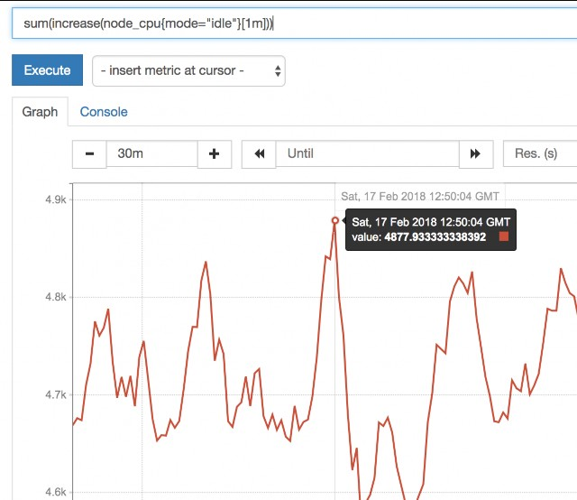
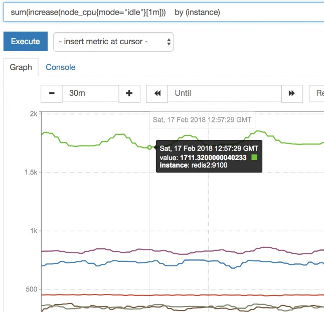

# 第七讲 Prometheus 数学理理论基础学习 （prometheus数学consule使使用）

- 第七讲内容概括
    -  回顾上篇最后留给大家的一个较难CPU使用率计算公式
    -  拆分并解释这个运算公式
    -  举一反三计算其他CPU状态

## 回顾上篇最后留给大家的一个较难CPU使用率计算公式

`(1-((sum(increase(node_cpu{mode="idle"}[1m])) by (instance)) / (sum(increase(node_cpu[1m])) by (instance)))) * 100`

上篇最后一节课给大家讲解了Linux系统中底层计算CPU占用率的方法

简单的总结如下：

Linux系统开启后，CPU开始进工作状态，每一个不同状态 的CPU使用时间都从零开始累计

而我们在被监控客户端安装的`snode_exporter`会抓取,并返回给我们 常用的八种CPU状态的`累积时间数值`

我们就先使用`用户态CPU`来给大家举个例子

- 用户态CPU
    - 通常是占用整个CPU状态 最多的类型 ， 当然也 有个别的情况，内核态或IO等待占用的更多
    - TOP => user%

举例

- 描述
    - 12:00 开机后 一直到 12:30 截止
    - 这30分钟的过程中 （当前我们先暂时忽略 是几核CPU 就当 作1核来说）
- 数据
    - CPU被使用在用户态 的时间 一共是 8分钟
    - CPU被使用在内核态 的时间 一共是 1.5分钟 
    - CPU被使用在IO等待状态 的时间 一共是 0.5分钟 
    - CPU被使用在Idle（空闲状态） 的时间 一共是 20分钟 (idle空闲状态的CPU时间 其实就是CPU处于没事干的时间)
    - CPU被使用在其他几个状态的时间 是0

上面的这些数据 为了我们计算CPU在这段30mins 时间的 使用 率 提供了单位数据基础

`CPU的使用率 = （所有非空闲状态的CPU使用时间总和 ）/（所有状态CPU时间的总和）`

有了这个公式后 咱们就可以很自然的 得出如下的`计算公式`
- `(user(8mins) + sys(1.5mins) + iowa(0.5min) + 0 + 0 + 0 + 0 ) / (30mins)`
- `= 10分钟 / 30分钟`
- `= 30%`

所以 针对这30分钟 我们的CPU平均使用率就是 30%

接下来 其实上面的这个计算公式 还是有一点点 累赘 我们可以换一个`更简明的算法`

`idle(20mins) / (30mins) => 70%`

空闲时间 除以 总时间 等于 空闲CPU的比例

然后我们

> 100% - 70% = 30%

是不是更简单了

说到这里之后 其实还有另外`两个问题`没有解决 咱们来分别说一下

上面这样的方法去计算 最终只能是算出 CPU在`30分钟` 内的 总平均时间

如果我要是问 那么中间的`某一分钟`之内CPU的总平均时间是 多少 ？？

那么使用当前的这个算法 我们就没办法 精确的知道 某一分钟 内的平均值了

（其实 也是合情合理的提问，对于向CPU这种实时变化的监 控数据，我们往往需要更精确的单位 去判断当前时刻 或者过 去某一时刻 更细节的即时状况 所以 只知道30分钟的平均值 是没有太大意思的）

如何解决这个问题？

还记得咱们学过 Counter 的数据类型吗？（虚拟的数据类型 针对返回的数值 他的使用途径）

node_exporter => node_cpu给我们返回的是 Counter 的数据

(CPU 底层是 时间的累积)

Counter 是一个 一直持续增长的数值

现在面临的问题是 30分钟内 CPU使用时间持续增长 UP， 我 们需要截取其中一段增长的`增量值`

如果我们能获得 1分钟的增量值 然后拿这个数值再去使用刚 才同样的 计算公式

那么 我们不就顺理成章的 得到了 1分钟的平均值了嘛？

解决办法 接踵而至

--

## prometheus 的数学查询命令给其实给我们提供了 非常丰富的 计算函数

关于种类繁多的 函数 我们从 第八讲开始 给大家逐一普及 在这里 我们先给大家 介绍一个 很实用的函数

### increase() 函数

increase 函数 在promethes中，是用来 针对Counter 这种持续增 长的数值，截取其中一段时间的增量

increase(node_cpu[1m]) =》 这样 就获取了 CPU总使用时间 在1分钟内的增量

这样 我们的第一个问题 就解决了 接下来 来看第二个问题

实际工作中的CPU 大多数都是多核CPU服务器

如下图 Node_exporter 给我们截图回来的

八种CPU状态 -> 每一个核

采集的数据 自然也是细到 采集到每一个核的CPU时间

不过我们在运维实际监控中 往往并不是太关注 每一个CPU核 表现如何

而是希望知道 整个CPU表现如何

（一般生产服务器 动不动CPU就是 16 20 32 40 48 核）

如果每一个CPU核 都单独来一个监控曲线图 意义不大 而且看 着图太混乱了

有什么办法可以解决这个问题？

prometheus提供了 另一个 `sum()` 函数 很频繁

sum( ) 就如其字面意思一样 起到value 加合的作用

sum( increase(node_cpu[1m]) )

外面套用一个sum 即可把所有核数值加合 问题就可以解决了

然后 我们一切就绪 接下来 我们把整个prometheus计算公式 在 下一个阶段进给拆分讲解

--

## 拆分 并 解释 这个运算公式

> (1-((sum(increase(node_cpu{mode="idle"}[1m])) by (instance)) / (sum(increase(node_cpu[1m])) by (instance)))) * 100

> (1-((sum(increase(node_cpu{mode="idle"}[1m])) by (instance)) / (sum(increase(node_cpu[1m])) by (instance)))) * 100

这个prometheus的计算公式 其实就是 咱们最后 那个 使用

100%- (空闲时间 / 总时间) 的方法

不过这个公式 直接拿来看 还是有点痛苦， 咱们来学一下 拆 分

- 首先第一步

key ： node_cpu 是 我们需要使用的 key name

直接输入后 如上图所示

目前这种图 没有任何意义 我们继续完善命令给

- 第二步

咱们把`idle空闲`的CPU时间 和 `全部CPU时间` 都给过滤出来

key 使用{} 做过滤

- node_cpu{mode="idle”} => 空闲
- node_cpu all

- 第三步

我们使用 `increase( [1m]) 把 node_cpu{mode="idle"}` 包起来

- increase(node_cpu{mode="idle"}[1m])
    -  代表 空闲CPU 1分 钟内的增量
- increase(node_cpu[1m]) 
    -  代表 all_CPu 1mins

这样就是 把一分钟的增量 的CPU时间给取出来了

到这一步以后 有点那个意思了

不过 因为CPU核数太多 曲线太混杂了 我们需要进一步加强公 式

- 第四步

我们使用 sum() 再包一层 increase(node_cpu{mode="idle"} [1m]).

到这里以后 感觉更像样子了

不过 我们细心的同学 又发现了一个问题…….

那就是 我们这个CPU的监控 其实采集的是 多台服务器的监控 数据

怎么现在变成就一条线了？？？

其实 是由于这个 sum()函数的原因

这个sum()函数 其实默认状况下 是把所有数据 不管是什么内 容 全部进给加合了……

不光把 每一台机器的 多个核加一起了（这个是我们需要的）

还把 所有机器的CPU 也全都加到一起了…..变成 服务器集群 总CPU平均值了….. 糗大了…

如何解决？ 看下一步

- 第五步 `by (instance)`

再给大家引出一个新的函数 （或者说是 一个新功能）

`by (instance)`

这个函数 可以把 sum加合到一起的数值 按照指定的一个方式 进给一层的拆分

instance代表的是 机器名

意思就是说 把sum函数中 服务器加合的这个糗事 再给它强给 拆分出来

我们来试一试吧

> sum(increase(node_cpu{mode="idle"}[1m])) by (instance)

哈哈 这下就帅气了..

- 第六步

这下3个问题全都解决了 让我们继续把公式写完整 看看输入

如何

- (1-((sum(increase(node_cpu{mode="idle"}[1m])) by (instance)) / (sum(increase(node_cpu[1m])) by (instance)))) * 100
    - sum(increase(node_cpu{mode="idle"}[1m])) by (instance) =》 是空闲CPU时间 1分钟的增量
    - sum(increase(node_cpu[1m])) by (instance) 是全部CPU时间 1分 钟增量

> 1-（sum(increase(node_cpu{mode="idle"}[1m])) by (instance) / sum(increase(node_cpu[1m])) by (instance)）

这样就得到了 空闲CPU的 百分比了

- 第七步

最后一步 用 1 去减掉 整个上面的公式 再 * 100

> (1-((sum(increase(node_cpu{mode="idle"}[1m])) by (instance)) / (sum(increase(node_cpu[1m])) by (instance)))) * 100

这样我们就得到了 最终我们期望的结果

基本上 大部分服务器的 CPU使用率 都在 50%以下 还是一个

比较良好的状态的 ^_^

虽然过程⿇烦一些 但是还是很炫酷的

（总使用率）

## （三）举一反三 查看几个其他CPU状态时间的 使用率

既然要看 每一个单独cpu类型的 使用率， 那么 1-idle的方式 就不好用了

sum(increase(node_cpu{mode="user"}[1m])) by (instance) / sum(increase(node_cpu[1m])) by (instance)

=》 用户态

sum(increase(node_cpu{mode="system"}[1m])) by (instance) / sum(increase(node_cpu[1m])) by (instance)

sum(increase(node_cpu{mode="iowait"}[1m])) by

(instance) / sum(increase(node_cpu[1m])) by (instance)

这样 我们就可以 举一反三 轻松获得 每一种CPU状态时间的 使用百分比了

说到这里 我们是不是发现 这下 TOP命令中的这一给 我们总 算是 彻底明⽩怎么回事了 对吗？

成就感满满的 对吗？

所以 就如我们之前所说

promethes 计算公式的使用 强制要求我们运维人员 必须要对 Linux系统的深层次的知识 要有一定的掌握（依赖Linux的命 令给 ）

不然 公式都没得写

有点麻烦的同时 ，更多的 是提供给我们 更加⼴阔的平台 让

我们尽情发挥

