第⼋讲 Prometheus 命令⾏行行使⽤用扩展以及一些常用函数的使⽤

本节课内容

- prometheus命令⾏格式
- rate 函数的使⽤
- increase 函数的使⽤
- sum函数使⽤
- topk(x,)
- count()

## prometheus命令⾏格式

- 新的key 
    - 这次我们选⽤ ⼀个新的key 来做讲解
    - 这个key 值得⼀说的是 并不是由我们熟悉的 node_exporter挖 掘⽽来
    - 我们⾃⾏定义 并且 使⽤ bash 脚本 + pushgateway的⽅法 推送到 prometheus server采集

> count_netstat_wait_connections !node_exporter（TCP wait_connect 数）

- 类型 
    - counter
        - A counter is a cumulative metric that represents a single monotonically `increasing counter` whose value can only increase or be reset to zero on restart. For example, you can use a counter to represent the number of requests served, tasks completed, or errors.
    - gauge
        - gauge类型的数据 属于随机变化数值，并不像counter那样 是 持续增长

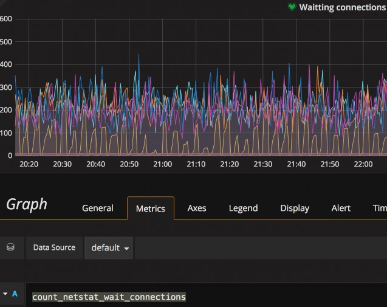

把⼀个key 直接输⼊ 命令⾏之后 得到的是 最原始的 数据输出

`count_netstat_wait_connections`

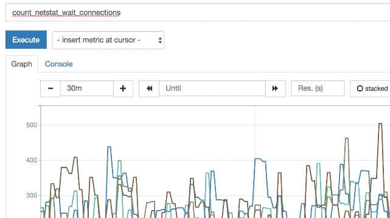

`counter类型`的数据 使⽤起来 相对容易的多 
CPU counter 不需 要任何 increase() rate() 之类的函数去计算 单位时间段的增量 直接输⼊后 就可以看到 已经成型的 有确实意义的曲线图

我就使⽤这个key 来进⾏我们的命令⾏ 正式的学习

count_netstat_wait_connections

默认输⼊后 会把所有 安装了这个采集项的 服务器数据都显⽰ 出来

我们来学习 命令⾏的 过滤

看下上⾯这张图的显⽰

后⾯的`{. }`的部分 属于标签

标签
- 也是来⾃于 采集数据， 可以⾃定义 也可以直接使⽤ 默认的exporter提供的标签项

上⾯的 这⼏个标签中 最重要的 是 exported_instance 指明 是

那台被监控服务器 “log” 是⼀台 ⽇志服务器的机器名

命令⾏的查询 在原始输⼊的基础上 先使⽤{} 进⾏第⼀步过滤

`count_netstat_wait_connections{exported_instance="log"}`

- 模糊匹配
    - 之后 就只显⽰ 这⼀台服务器的 数据 过滤除了精确匹配 还有 `模糊匹配`
    - count_netstat_wait_connections{exported_instance=~"web.*"}
    - 正则表达式 
        - .* 属于正则表达式 
        - 模糊匹配 =~ 
        - 模糊不匹配 !~

把所有 机器名中 带有 web的 机器都显⽰出来（看图演⽰）

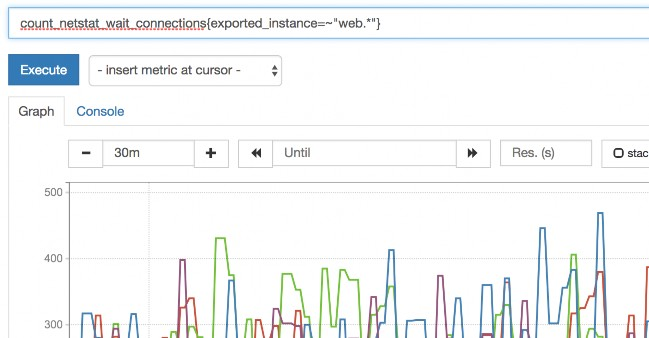

- 数值的过滤
    - 标签过滤之后 就是数值的过滤
    - ⽐如 我们只想找出 wait_connection数量 ⼤于200的
    - count_netstat_wait_connections{exported_instance=~"web.*"} > 400

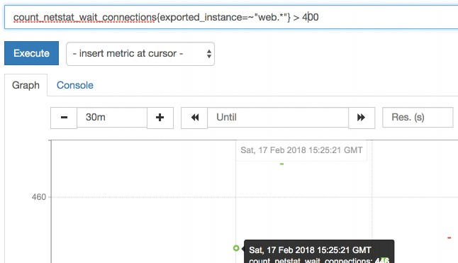

这时候 发现图上 看不到曲线了 只看到 很⼩的点

是因为 我们 > 400的过滤 在30分钟之内 只有很少的时间点 达到了这个数值

## rate 函数的使⽤
----------------

rate 函数可以说 是prometheus提供的 最重要的函数之⼀

rate()

> rate(v range-vector) calculates the per-second average rate of increase of the time series in the range vector. Breaks in monotonicity (such as counter resets due to target restarts) are automatically adjusted for. Also, the calculation extrapolates to the ends of the time range,

> allowing for missed scrapes or imperfect alignment of scrape cycles with the range's time period.

> The following example expression returns the per-second rate of HTTP requests as measured over the last 5 minutes, per time series in the range vector: rate(http_requests_total{job="api-server"} [5m])

上⾯这⼀段 是官⽹给提供的解释 我们来简单翻译⼀下

gauge

> rate(. ) 函数 是专门搭配`counter`类型数据使⽤的函数 它的功能 是按照设置⼀个时间段，取counter在这个时间段中 的 平均`每秒`的增量

这么说可能还是有点抽象 咱们来举个例⼦吧

- key node_network_receive_bytes
    - 来源
        - node_exporter
    - 含义
        - ⽹络接收字节数
    - 类型
        - 本⾝是⼀个counter类型
    - 是否合适单独使用
        - 咱们之前也学习过了 对于这种 持续增长的 counter数据，直 接输⼊key 是没有任何意义的， 我们必须要 以获取单位时间内 增量的⽅式 来进⾏加⼯ 才能 有意义
        - 通常的使⽤发放 就是直接⽤ rate() 包上。（increase(). 也是 可以的 我之后会讲到）
    - rate(node_network_receive_bytes[1m])
        - node_network_receive_bytes 被rate(. [1m])包上以后 就可以获取到 在1分钟时间内，平均每秒钟的 增量
        - 
        - 这样以来 数据就变得有意义了
    - 强调
        - 没有意义
            - 任何counter数据类型 , 直接使用rate() 或者 increase()函数，没有意义
            - 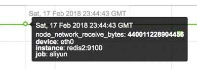

### 解释rate()，以及不同时间宽度对曲线平缓陡峭的影响

接下来我们把rate()做的事情 更加细化的 咱们来解释⼀下

⽐如上⾯这个图， ⽹络接收字节数 ⼀直不停的累加 从 23:44开始 到 23:45

⽐如累积量 从440011229804456 到了 -> 440011229805456

1分钟内 增加了 1000bytes （假设）

从 23:45开始 到 23:50

⽐如累积量 从440011229805456 到了 -> 440011229810456

5分钟内 增加了 5000bytes（假设）

加⼊rate(. [1m]) 之后

会把 1000bytes 除以 1m*60秒 ， =～16bytes/s

就是这样 计算出 在这1分钟内，平均每秒钟增加 16bytes

这个还是⽐较好理解的

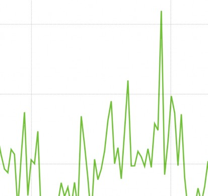

接下来 咱们修改 1m => 5m

变成这样 rate(. [5m])

这样就变成 把5分钟内的增量 除以 5m*60

5分钟的增量 假如是 5000 ， 那么除以300 以后 也还是约等于

=~ 16bytes/s

感觉好像是⼀模⼀样的？

那么我们来看下输出 rate[5]

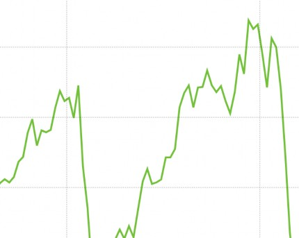

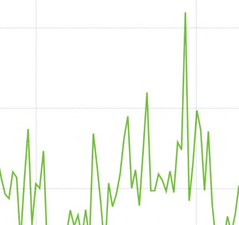

啊？ 感觉图形发⽣了⼀定的变化 怎么回事？

--

明明是⼀样的 平均 16/s 啊 怎么图形变了呢？

事实是这样的

如果 我们按照 rate(1m)这样来取，那么是取1分钟内的增量 除 以秒数

如果 我们按照 rate(5m)这样来取，那么是取5分钟内的增量 除 以秒数

⽽这种取法 是⼀种平均的取法 ⽽且是假设的

刚才我们说 counter在 ⼀分钟 5分钟 之内的增量 1000 和 5000

其实是⼀种假设的理想状态

事实上 ⽣产环境 ⽹络数据接收量 可不是这么平均的

有可能在 第⼀分钟内 增加了 1000 ， 到 第⼆分钟 就变成增加 了2500 ….

所以 rate(1m) 这样的取值⽅法 ⽐起 rate(5m) ，因为它取的时 间段短，所以 任何某⼀瞬间的凸起或者降低

在成图的时候 会体现的更细致 更敏感

⽽ rate(5m) 把整个5分钟内的 都⼀起平均了，那么当发⽣瞬时

凸起的时候 ，会显得图平缓了⼀些 （因为 取的时间段长 把 波峰波⾕ 都给平均消下去了）

那么我们再放⼤⼀些 看看 rate(20m) 会怎么样

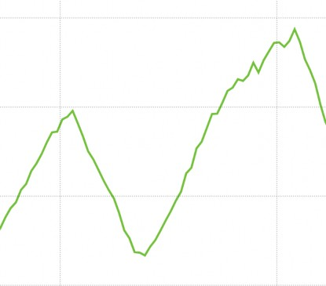

哈哈 😄 是不是就更平缓了 在我们的⼯作中 取1m 还是取5m

这个取决于 我们对于监控数据的敏感性程度来挑选 说到这⾥ 我们对rate（） 函数 应该也有了⼀定的了解了 接下来 咱们继续学习 第⼆个重要的函数

## increase函数 使⽤

increase 函数 其实和rate() 的概念及使⽤⽅法 ⾮常相似

rate(1m) 是取⼀段时间增量的平均每秒数量

increase(1m) 则是 取⼀段时间增量的总量

⽐如

increase(node_network_receive_bytes[1m])

取的是 1分钟内的 增量总量 和

rate(node_network_receive_bytes[1m])

取的是 1分钟内的增量 除以 60秒 每秒数量

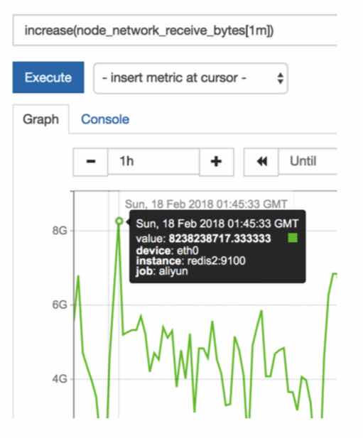

increase(node_network_receive_bytes[ 1m])

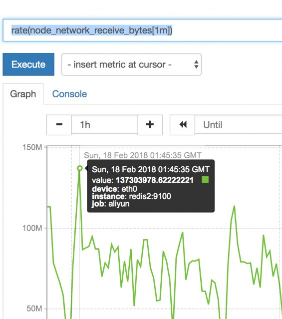

从这两个图 我们可以看到 其实曲线的⾛势 基本是⼀样的 但是 显⽰出来的数量级bytes 可不⼀样

137303978 * 60 = 8238238680 (发现)

正好是 60倍 

也就很好理理解了了，increase() 是不不会取⼀一秒的平均值的

incraese() rate()

监控 获取采集数据源

频率

5m =》 rate() 形成图 断链 increase(5m)

rate() -> CPU 内存 硬盘 IO ⽹络流量

counter

##  sum()函数的学习

sum()函数的使⽤ , 我们在上节课 讲CPU拆分公式的时候 已经 讲过了

sum就是 总取合

sum 会把结果集的输出 进⾏总加合

⽐如

rate(node_network_receive_bytes[1m]) 显⽰的结果集 会包含如 下内容

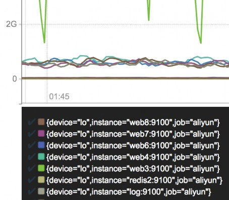

从标签 我们就不难看出，有好多台服务器 都返回了 这个监控

数据

当我们使⽤ sum()包起来以后 sum(rate(node_network_receive_bytes[1m])) 就变成下⾯这样了

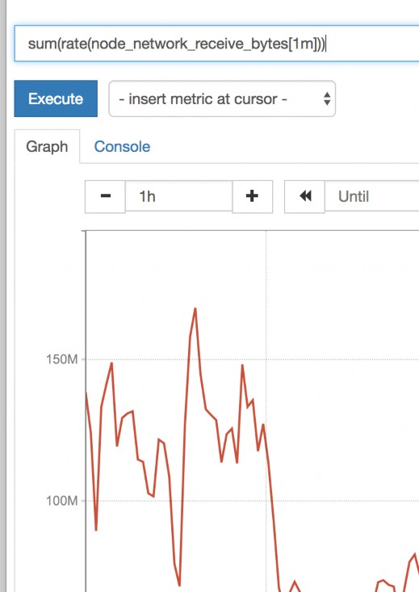

变成⼀条线了 …

等于是 给出了 所有机器的 每秒请求量..

我们之前也说过，如果要进⾏下⼀层的拆分 需要在 sum() 的后⾯ 加上 by (instance)

才可以按照 机器名 拆分出⼀层来

sum() 加合 其实还有更多巧妙使⽤

instance

sum () by (cluster_name)

如果是 by instance 那么 其实跟 不加sum()的输出结果是⼀样 的

本来 rate(node_network_receive_bytes[1m]) 就已经是按照每台 机器 返回了

但是如果 我们希望 按集群总量输出呢？

⽐如 我们返回了20台机器的数据

其中 有6台 属于 web server 10台属于 DB server

其他的 属于⼀般server

那么我们这时候 sum() by (cluster_name) 就可以帮我们实现 集 群加合并分三条曲线输出了

100 - 1000 CPU

顺带⼀提的是 (cluster_name) 这个标签，默认node_exporter

是没有办法提供的

node_exporter只能按照 不同的机器名 去划分

image

如果希望 ⽀持cluster_name 我们需要`⾃⾏定义标签` 😃 往后的课程 我们会涉及到这个内容

##  topk()函数的学习

定义：取前⼏位的最⾼值

- Gauge类型的使⽤
    - topk(3,count_netstat_wait_connections)
- Counter类型的使⽤
    - topk(3,rate(node_network_receive_bytes[20m]))

这个函数 还是⽐较容易理解的，根据给定的数字 取数值最⾼

>=x 的数值 唯⼀需要注意的是

这个函数 ⼀般在使⽤的时候 只适合于 在console查看 graph的 意义不⼤

如下图所⽰

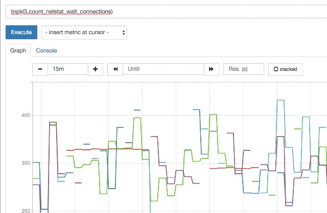

Topk因为对于每⼀个时间点 都只取前三⾼的数值

那么必然会造成 单个机器的采集数据不连贯

因为：⽐如 server01在在这⼀分钟的 wait_connection数量排在 所有机器的前三 ，到了下⼀分钟 可能就排到垫底了.. ⾃然其 曲线就会中断

实际使⽤的时候 ⼀般⽤topk（）函数 进⾏瞬时报警 ⽽不是为 了观察曲线图

CPU 10 40核 400项

topk(10, rate(CPU))

CPU 更多不看核（很⾃然的分布在多核 服务器 软件）

##  count()函数的学习

定义： 把数值符合条件的 输出数⽬进⾏加合 举个例⼦

找出当前（或者历史的）当TCP等待数⼤于200的 机器数量

count(count_netstat_wait_connections > 200)

这个函数在实际⼯作中还是很有⽤的

⼀般⽤它count进⾏⼀些模糊的监控判断

⽐如说 企业中有100台服务器，那么当只有10台服务器CPU⾼ 于80%的时候 这个时候不需要报警

但是 当符合80%CPU的服务器数量 超过 30台的时候 那么就 会触发报警 count()

到这⾥ 我们第⼋讲结束

顺便提⼀句 prometheus提供的函数 其实还远远不⽌这⼏个

这节课中 列出的6个函数 是作为 ⼯作中使⽤频率最⾼的函数

（或者说 如果这6个函数 不会的话 那么监控基本没发做）

其他更多的函数 感兴趣的朋友 可以去prometheus官⽅⽹站继 续学习 https://prometheus.io/docs/prometheus/latest/querying/functions/

也欢迎多给⼤⽶提建议和补充新函数知识点

