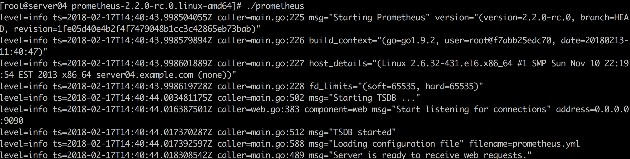

# 第9讲 企业级监控数据采集⽅方法(prometheus与node_exporter的安装与介绍)

第九讲内容如下
- prometheus 服务端的安装和后台稳定运⾏
- prometheus 服务端配置⽂件写法
- node_exporter 安装和后台运⾏
- node_exporter 观察 和 采集数据
- prometheus 查询采集回来的各种数据
- 使⽤我们之前的学过的 prometheus 命令⾏的形式 练习组合 各种监控图


##  prometheus 服务端的安装和后台稳定运⾏ 

- 下载
    - prometheus 的下载地址 https://prometheus.io/download/#prometheus

- 安装
    ```
    prometheus-2.2.0-rc.0.linux-amd64.tar.gz 最新版

    prometheus_server下载

    [root@server04 down]# tar -xvzf prometheus-2.2.0-rc.0.linux- amd64.tar.gz

    cp -r prometheus-2.2.0-rc.0.linux-amd64 /usr/local/
    ```
- 启动
    之后解压缩后 即可直接运⾏在默认的9090端⼜ 直接就可以使

    - 


后台运行


- 第⼀种： 安装screen⼯具 放⼊后台运⾏


这种screen放⼊后台运⾏的⽅式 最简单快速了 最适合懒⼈使⽤….⽐如我 哈哈😁


screen还有另外⼀个好处 就是 可以随时切换进⼊ 程序前台窗

⼜ 查看各种调试信息


screen 也有不好的地⽅

- 不够正规化 总觉得还是个临时办法
- screen -l 提供的后台 列表 不够⼈性化，很多时候 你记不 住 到底哪个是哪个
- 很容易被误关闭 操作的时候 ctrl +ad / ctrl +d 不⼩⼼操作

错了 直接就退出去了..


- 第⼆种： 使⽤daemonize 放⼊后台⽅式 daemonize Unix系统后台守护进程管理软件 优点：更加正规 后台运⾏更稳定


    - git clone git://github.com/bmc/daemonize.git
    - sh configure && make && sudo make install
    - daemonize -c /data/prometheus/ /data/prometheus/up.sh
        - -c 是指定运⾏路径


/data/prometheus/up.sh 是运⾏路径下的 ⼀个启动脚本 下⾯是这个启动脚本的内容 内容：就是开启prometheus进程

[root@prometheus yd]# cat /data/prometheus/up.sh

/data/prometheus/prometheus --web.listen- address="0.0.0.0:9090" --web.read-timeout=5m --web.max- connections=10 --storage.tsdb.retention=15d -- storage.tsdb.path="data/" --query.max-concurrency=20 -- query.timeout=2m

然后 我们来看下 ./prometheus 在实际企业运⾏时 启动参数的

合理配置


--web.read-timeout=5m Maximum duration before timing out read of the request, and closing idle connections. 请求链接的最⼤等待时间 prometheus process -> GET PUSH

防⽌ 太多的空闲链接 占⽤资源


--web.max-connections=512 Maximum number of simultaneous connections.

最⼤链接数


--storage.tsdb.retention=15d

How long to retain samples in the storage. prometheus开始采集监控数据后 会存在内存中和硬盘中 对于保留期限的设置 很重要 太长的话 硬盘和内存都吃不消 / 太短的话 要查历史数据就没有了

企业中设置 15天为宜


—


--storage.tsdb.path="data/"

Base path for metrics storage.

存储数据路径 这个也很重要 不要随便放在⼀个地⽅就执⾏ 会 把/ 根⽬录塞满了

--query.timeout=2m Maximum time a query may take before being aborted.

--query.max-concurrency=20

Maximum number of queries executed

concurrently.


上⾯这两项 是对 ⽤户执⾏prometheus 查询时候的 优化设置 防⽌太多的⽤户同时查询，也防⽌单个⽤户执⾏过⼤的查询

⽽⼀直不退出


如上这⼏项参数 配置上去后 prometheus运⾏ 就相对稳妥多了


web上直接输⼊ ip:port 就可以进⼊⾸页 这⾥遇到⼀个问题

就是 prometheus 对系统时间 ⾮常敏感 ⼀定要时时刻刻 保证 系统时间同步 不然 曲线是乱的

ntpdate 循环同步时间后 错误提⽰就没有了


prometheus 运⾏时 存放的历史数据 在这⼉


其中 这些 长串字母的 是历史数据保留


⽽ 当前近期数据 实际上保留在内存中


并且 按照⼀定间隔 存放在 wal / ⽬录中 防⽌突然断电 或者 重 启 以⽤来 恢复内存中的数据 （这个咱们之前也提到过）


##  prometheus 服务端配置⽂件写法


prometheus_server 安装稳妥之后 咱们要来看下配置⽂件

/data/prometheus/prometheus.yml

配置⽂件是 运⾏在哪个⽬录 就默认读取 哪个⽬录下

prometheus.yml⽂件 除⾮使⽤参数指定其他位置的 配置⽂件


配置⽂件中 我们主要关注 这⼏个地⽅
```yaml
global:
    scrape_interval: 15s # Set the scrape interval to every 15 seconds. Default is every 1 minute.
    evaluation_interval: 15s # Evaluate rules every 15 seconds. The default is every 1 minute.
scrape_configs:

    # The job name is added as a label `job=<job_name>` to any timeseries scraped from this config.
    - job_name: 'prometheus'
        # metrics_path defaults to '/metrics'
        # scheme defaults to 'http'.
      static_configs:
        - targets: ['prometheus.server:9090','prometheus.server:9100']
    - job_name: 'pushgateway' 
      static_configs:
        - targets: ['localhost:9091','localhost:9092']
    - job_name: 'aliyun' 
      static_configs:
        - targets: [‘server4:9100','web3:9100’,'server6:9100’,'sesrver7:9100','we b8:9100','log1:9100’,'mysql1:9100’]
```
- scrape_interval
    - ⼀个就是 全局变量 scrape_interval 设置多少时间间隔 采集⼀次数据

- job
    - 另⼀个 就是 job和targets的写法 配置⼀个job的标签，然后 在 这个标签下 定义 我们需要监控的机器
    - targets: [‘server4:9100’ 
        - hostname + 端口
            - ⽽这⾥的端口 实际上 就是 node_exporter的默认运⾏端⼜

```
hostname server01 prometues => dns
/etc/hosts
local dns server
```

##  node_exporter 安装和后台运⾏


node_exporter的下载和安装 跟prometheus也是⼀样的

- 下载
    - 下载地址为
         - https://prometheus.io/download/#node_exporter
- 启动
    - 同样适⽤ daemonize 放⼊被监控服务器后台运⾏
    ```
    [root@web7 ~]# ps -ef | grep node_exporter
    root 7400 1 0 2017 ? 00:00:00 /bin/sh /usr/local/ node_exporter/up.sh
    root 7402 7400 0 2017 ? 01:34:41 /usr/local/ node_exporter/node_exporter
    默认运⾏在 9100端⼜
    ```

##  node_exporter 观察 和 采集数据 运⾏在后台以后

我们需要 针对这个 node_exporter 进⾏初步的⼿动查询 以确 保 正常获取监控数据


本地查询
```
[root@web7 ~]# curl localhost:9100/metrics

node_cpu{cpu="cpu7",mode="steal"} 0
node_cpu{cpu="cpu7",mode="system"} 131503.32
node_cpu{cpu="cpu7",mode="user"} 397798.53 
```
prometheus 15s GET请求

只有挑⼏个重要的 key 看到有数据采集上来 就OK了

prometheus 命令⾏


node_exporter 经过实际测试 在 Centos/Redhat 任意版本系统中 均可以顺利运⾏ （ubantu debian ）

还没有遇到过 什么问题


给node_exporter的开发者 点个赞 👌


然后 我们去到 node_exporter在 github上的地址

来看看 我们伟⼤的社区开发者们 都给咱们提供了 哪些有⽤的 采集项⽬


https://github.com/prometheus/node_exporter


尽然在 github上 那就很⾃然了 咱们的node_exporter 也⼀样是

开源项⽬

本⾝使⽤ go语⾔发开

后⾯ 提供了 node_exporter 默认开启 和 不开启的 监控项⽬ 可以监控的内容⾮常的多 庞⼤

感兴趣的朋友 可以⾃⾏ 满满挖掘

[node_exporter启动参数.md](./node_exporter启动参数.md.md)

##  prometheus 查询采集回来的各种数据 

接下来 我们回到 prometheus的主界⾯

验证⼀下 我们新部署的 监控机器上的node_exporter 是否给我 们 正确返回了 数据

随便挑⼏个 key 就可以查看

另外 prometheus 的命令⾏ 本⾝也⽀持suggest 功能（输⼊提⽰）


随便找个key 查询⼀下 是否有输出图输出 就可以了

本⾝node_exporter提供的 keys 实在太多了 （因为 都是从 Linux系统中的 底层 各种挖掘数据回来）


我们没有时间 也没有必要 把每⼀个key 都掌握 只要知道 ⼀ 部分重要的 必须的key 就⾜够了

##  使⽤我们之前的学过的 prometheus 命令⾏的形式 练习 组合各种监控图

接下来 咱们找⼀个 ⽐较重要的key 然后 ⽤我们学过的 命令⾏

⽅式 给他组成⼀个 `临时监控图`

⽐如 node_cpu node_memory node_disk

等等 这⾥我们不再做演⽰了

可以⾃⾏找⼏个类似的 keys 组成监控图


不过这⾥有⼀个问题..

命令⾏组成监控图之后 这些图都是临时的 如果我关闭了浏 览器 那么下次再想看的时候就没有了 又要重新输⼊查询语句

（⿇烦不）

⽽且prometheus ⾃带的这个 监控图 实际上 并不美观

那么我们如何 既能永久保存这些 监控图 ，又可以让它更美观呢？

请关注 我们后⾯的篇章（Grafana + promethues）

