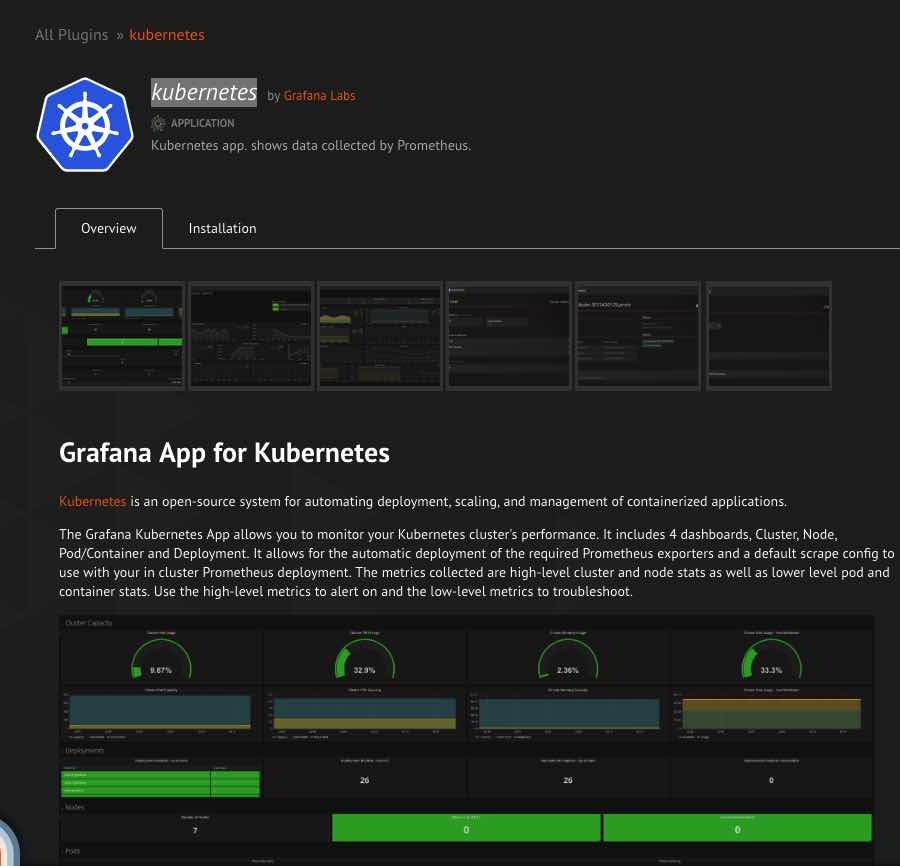

https://grafana.com/plugins/grafana-kubernetes-app

what's purpose for this plugin

after Deploy it This will deploy a `Node Exporter DaemonSet`, to collect health metrics for every node, and a Deployment that collects cluster metrics.
