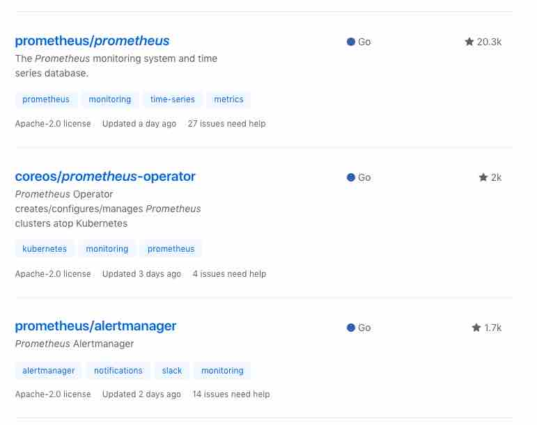

## Prometheus Operator

what resource could be monitored by Prometheus

- cluster state via `kube-state-metrics`
- nodes via the `node_exporter`
- kubelets
- apiserver
- kube-scheduler
- kube-controller-manager

manifests

https://github.com/coreos/prometheus-operator/tree/master/contrib/kube-prometheus/manifests

how to host Prometheus

## grafana Authentication & permissions
GitHub OAuth2 Authentication

http://docs.grafana.org/auth/github/

permissions

http://docs.grafana.org/permissions/overview/
