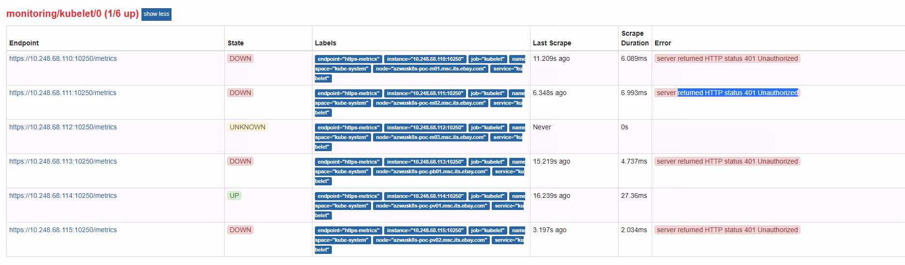

Prometheus kubelet metrics server returned HTTP status 403 Forbidden


## decription



## solution

check the kubelet metrics work or not

[curl](curl.md)


## update kubelet init parametes

1. remove `cadvisor-port=0`
2. add `--authentication-token-webhook=true --authorization-mode=Webhook`

```
KUBEADM_SYSTEMD_CONF=/etc/systemd/system/kubelet.service.d/10-kubeadm.conf
sed -e "/cadvisor-port=0/d" -i "$KUBEADM_SYSTEMD_CONF"
if ! grep -q "authentication-token-webhook=true" "$KUBEADM_SYSTEMD_CONF"; then
  sed -e "s/--authorization-mode=Webhook/--authentication-token-webhook=true --authorization-mode=Webhook/" -i "$KUBEADM_SYSTEMD_CONF"
fi
systemctl daemon-reload
systemctl restart kubelet


```


```
KUBEADM_SYSTEMD_CONF=/etc/kubernetes/kubelet.env
cat "$KUBEADM_SYSTEMD_CONF"
sed -e "/cadvisor-port=0/d" -i.bak1 "$KUBEADM_SYSTEMD_CONF"
sed -e "s/--anonymous-auth=false/--anonymous-auth=false --authentication-token-webhook=true --authorization-mode=Webhook/" -i.bak2 "$KUBEADM_SYSTEMD_CONF"
systemctl daemon-reload
systemctl restart kubelet
systemctl status kubelet
```

## kubelet reference
https://kubernetes.io/docs/reference/command-line-tools-reference/kubelet/


- --authentication-token-webhook
    - Use the TokenReview API to determine authentication for bearer tokens.
- --authorization-mode string
    - Authorization mode for Kubelet server. Valid options are AlwaysAllow or Webhook. Webhook mode uses the SubjectAccessReview API to determine authorization. (default "AlwaysAllow")


## reference

Prometheus kubelet metrics server returned HTTP status 403 Forbidden

http://centosquestions.com/prometheus-kubelet-metrics-server-returned-http-status-403-forbidden/
