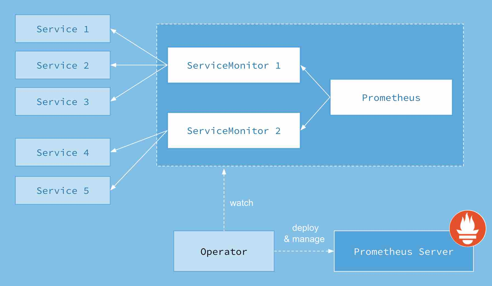

The Prometheus Operator introduces additional resources in Kubernetes to declare the desired state of a Prometheus and Alertmanager cluster as well as the Prometheus configuration. The resources it introduces are:

- Prometheus
    - The Prometheus resource declaratively describes the desired state of a Prometheus deployment,
- ServiceMonitor
    - a ServiceMonitor describes the set of targets to be monitored by Prometheus.
- Alertmanager



## serviceMonitorSelector
The Prometheus resource includes a field called `serviceMonitorSelector`, which defines a selection of `ServiceMonitors` to be used.

### example

First, deploy three instances of a simple example application, which listens and exposes metrics on port 8080.
```yaml
apiVersion: extensions/v1beta1
kind: Deployment
metadata:
  name: example-app
spec:
  replicas: 3
  template:
    metadata:
      labels:
        app: example-app
    spec:
      containers:
      - name: example-app
        image: fabxc/instrumented_app
        ports:
        - name: web
          containerPort: 8080
```
The ServiceMonitor has a label selector to select Services and their underlying Endpoint objects. The Service object for the example application selects the Pods by the app label having the example-app value. The Service object also specifies the port on which the metrics are exposed.

```yaml
kind: Service
apiVersion: v1
metadata:
  name: example-app
  labels:
    app: example-app
spec:
  selector:
    app: example-app
  ports:
  - name: web
    port: 8080
```

This Service object is discovered by a ServiceMonitor, which selects in the same way. The app label must have the value example-app.

```yaml
apiVersion: monitoring.coreos.com/v1
kind: ServiceMonitor
metadata:
  name: example-app
  labels:
    team: frontend
spec:
  selector:
    matchLabels:
      app: example-app
  endpoints:
  - port: web
```